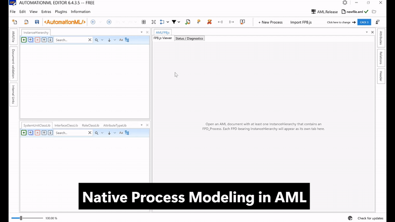

# AMLFPB.js

An [AutomationML Editor](https://www.automationml.org/) plugin that embeds the [FPB.js](https://github.com/hamiedNabizada/FPB.js) modeller for editing VDI 3682 Formalised Process Descriptions (FPD) directly in the editor — without switching tools and without losing custom AML attributes along the way.

This is research-quality software. APIs are not yet stable.



## What it does

- **Native FPD authoring inside the editor.** Open any AML document that carries FPD content and edit it visually — process operators, states, flows, decomposition, the full VDI 3682 vocabulary.
- **Lossless round-trip.** Custom attributes, InternalLinks, and other CAEX content that lives next to the FPD elements survive every edit. The classic standalone mapper rewrites the document on each conversion; the plugin updates in place.
- **Two-way live sync with the AML tree.** Edits made in the AML tree show up in the diagram within a few seconds. Edits in the diagram land in the tree when you click **Update InstanceHierarchy**.
- **Modeling rule validation.** Connections that violate VDI 3682 Part 2 (e.g. a state directly connected to another state, missing system limit) raise a warning at update time.
- **Multi-IH support.** One viewer sub-tab per FPD InstanceHierarchy in the active document.
- **Decomposition.** Decompose a process operator into a sub-process, edit it on its own layer, compose it back. Boundary states stay synchronised across layers.

## Requirements

- AutomationML Editor 6.4.0 or newer
- Windows with WebView2 runtime installed
- For building from source: .NET 8 SDK and Node.js 18+

## Installation

1. Download the latest `Aml.Editor.Plugin.FPB.<version>.nupkg` from the [releases page](https://github.com/hsu-aut/AMLFPB.js/releases).
2. In the AutomationML Editor, open the Plug-In Manager, add a local source pointing at the folder that contains the `.nupkg`, and install the package.
3. Restart the editor. The plugin appears as the "AMLFPBjs" tab.

## Usage

After installation, open any AML document with FPD content, or use **+ New Process** in the editor toolbar to start an empty one.

### Editing flow

- Changes in the FPB.js viewer are buffered until you click **Update InstanceHierarchy** in the tab's toolbar. That writes the buffered changes into the CAEX document. `Ctrl+S` then persists them to disk.
- Changes in the AML tree are picked up by the viewer automatically after a few seconds. **Refresh from AML** forces an immediate refresh.

### Decomposition

Right-click a process operator and choose **Decompose**. The plugin creates a sub-process layer and links its boundary states back to the parent. Switch between layers via the layer panel and edit each in isolation — edits to boundary states propagate to the other layer because they represent the same logical element.

### New processes and JSON exchange

- **+ New Process** (editor toolbar) — creates an empty FPD InstanceHierarchy.
- **Import FPB.js** (editor toolbar) — adds a new IH from a `.json` file produced by [fpbjs.net](https://www.fpbjs.net) or any other FPB.js-based application.
- **Export JSON** (per IH tab) — writes the current IH content to a `.json` file.

## Architecture

```
AutomationML Editor                AMLFPB.js                          FPB.js
                                   ─────────                          ──────
DocumentLoaded         ─►  FpbPlugin
ChangeSelectedObject   ─►  ├── IhView (one per IH)
                           │   ├── WebView2  ◄── importJSON ◄────────  Diagram
                           │   ├── Bridge                              + UI
                           │   ├── pending snapshot
                           │   └── hash-poll live sync
                           │
                           └── calls the mapper:
                               ├── FpbJsonToCaex.UpdateInPlace     ──► CAEX
                               ├── FpbJsonToCaex.ImportInto
                               ├── CaexToFpbJson.Convert            ◄── CAEX
                               └── Vdi3682Validator
```

The plugin itself handles tab lifecycle, the host-to-JavaScript bridge, diagnostics, and editor integration. CAEX conversion and VDI 3682 validation live in [`fpb-aml-mapper`](https://github.com/hsu-aut/fpb-aml-mapper). The diagram surface, palette, layer panel, and properties panel come from [`FPB.js`](https://github.com/hamiedNabizada/FPB.js).

## Build from source

The plugin needs both sibling repositories cloned next to it:

```
<parent>/
├── fpb-aml-editor-plugin/
├── fpb-aml-mapper/
└── FPB.JS/
```

Build:

```powershell
cd FPB.JS
npm install
npm run build

cd ..\fpb-aml-editor-plugin
dotnet build Aml.Editor.Plugin.FPB.sln -c Release
```

The resulting `.nupkg` lands in `build\Plugins\Aml.Editor.Plugin.FPB\Release\`.

## Known limitations

Two pieces of functionality use reflection or polling because the editor's plugin API does not expose them:

- The auto-save trigger looks up `SaveAMLCommand` on `Application.Current.MainWindow.DataContext`. If the editor renames or restructures it, the plugin falls back to manual `Ctrl+S`.
- The AML-tree to viewer synchronisation polls a SHA-256 of the IH XML every two seconds, because Aml.Engine has no public change event.

Both paths are monitored at startup by a compatibility check; any drift shows up as a banner in the plugin's Diagnostics tab. Verbose log output lives under `%TEMP%\fpb-plugin\fpb-plugin-debug.log`.

## Configuration

Settings are persisted in `%APPDATA%\AutomationMLEditor\FpbPlugin\settings.json`:

| Key | Default | Effect |
|---|---|---|
| `debug_logging` | `false` | Forwards the JavaScript console to the log file. |
| `auto_save_after_update` | `false` | Triggers the editor's save command after each Update InstanceHierarchy. |
| `run_vdi_validation` | `true` | Runs VDI 3682 structural checks automatically. |
| `confirm_large_updates` | `true` | Shows a confirmation dialog when an update would touch many elements or connections. |
| `update_safety_threshold` | `5` | Threshold for the confirmation dialog. |
| `pending_age_warning_minutes` | `30` | Warns before applying a pending edit older than this. |
| `disabled_validation_rules` | `[]` | List of VDI 3682 rule IDs to skip during validation. |

The boolean toggles are exposed in the plugin's Diagnostics tab. The numeric values are edited in the JSON file directly.

## License

[MIT](LICENSE).
